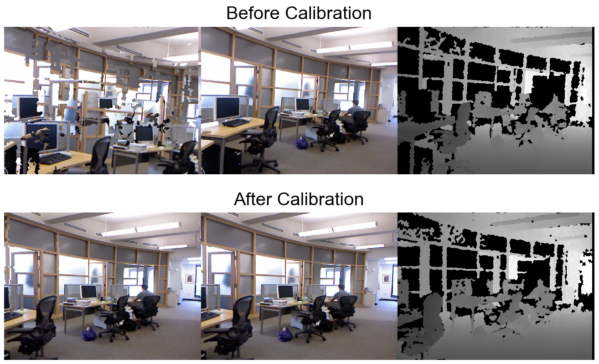

# illumiGrad

Automatically calibrate RGBD cameras online with PyTorch. The main idea is that the camera matrices are wrapped in ```torch.nn.Parameter``` so they can be updated with Adam optimizer based on the reprojection error after differentiably projecting the depth camera into the color camera, which is essentially bundle adjustment without the pose graph. In practice, illumiGrad can improve your computer vision accuracy in the wild without needing precise calibration since the calibration is continuously updated for you, a decent initial calibration is necessary though. No calibration targets, such as checkerboards, are required. I tested on semi-rectified color and Kinect V1 depth cameras from the [NYU Depth V2 dataset](https://cs.nyu.edu/~silberman/datasets/nyu_depth_v2.html). Related work using reprojection error as a loss signal: [Direct Visual Odometry](https://openaccess.thecvf.com/content_iccv_2013/papers/Engel_Semi-dense_Visual_Odometry_2013_ICCV_paper.pdf), [RGBD Direct Visual Odometry](http://citeseerx.ist.psu.edu/viewdoc/download?doi=10.1.1.402.5544&rep=rep1&type=pdf), [CVPR 2017](https://arxiv.org/pdf/1704.07813.pdf), [ICCV 2019](https://arxiv.org/pdf/1806.01260.pdf).

<p align="center">
  
</p>


## Setting up color camera and depth camera

1. I tested on semi-rectified color and depth cameras in a stereo arrangement. This lets us constrain optimization by initializing with identity rotation. The translation and rotation vectors are updated during optimization, but there is a better chance of convergence if you tune the x component of the translation vector from the depth camera to the color camera. I initialize the x component of the translation vector to 0.1.

2. There is a better chance of convergence if you initialize the focal lengths in a sensible range. The focal length fx = F * s, where F is your lens in mm and s is the unit-less horizontal resolution. Repeat for fy. F and s can be found either in the metadata of your image or can be easily looked up through the technical camera docs online. I tested with randomly initializing focal lengths between 400 and 600. I initialize the other intrinsic matrix parameters to 0.5.

In summary, get the cameras decently rectified and initialize the camera matrices sensibly close to ground truth. This will ensure better calibration performance. If optimization is failing early, revisit these steps first. 

## Dependencies
- PyTorch 1.10.2, used torch.linalg.pinv() which is only available in newer pytorch

## Calibrate

I only tested NYU Depth V2 and provide a short segment of it. I recommend using scenes with weak perspective and valid depth pixels to calibrate since they optimized better from my experience (middle and bottom video from above). When there is strong perspective and less valid depth pixels optimization struggled more (top video from above). Taking a varied video of a dynamic environment will potentially improve performance because it gives optimization a chance to get out of local minima. Optimization infrequently diverged after quality convergence even for long videos with varied scenes, so it seems that camera matrix initialization matters most and quality scene content initialization matters second for good final convergence. 

Calibrate with:

```shell
python main.py 
```

This image should appear after optimization is complete:



## Contributing

In pursuit of usability, illumiGrad should be easy to install and real time. Feel free to contribute to the following efforts below, or other useful efforts not listed. Contributions that either slow down illumiGrad below real time or require 3rd party dependencies (besides PyTorch and maybe Cython for speeding up certain parts with C/C++) will not be considered. 

* Extend illumiGrad to work with only stereo cameras using classic techniques such as block matching. This is possible since we get metric depth from stereo, which enables treating one of the cameras as a depth camera. No deep learning for stereo since illumiGrad should work on any camera with minimal tuning required in the wild.
* Implement a local pose graph over ~5 frame window. This might alleviate needing a decent initial calibration since we have more data (not sure).
* Add coarse pose estimation loss to help with optimization. Must be lightweight (sparse optical flow for example). 


